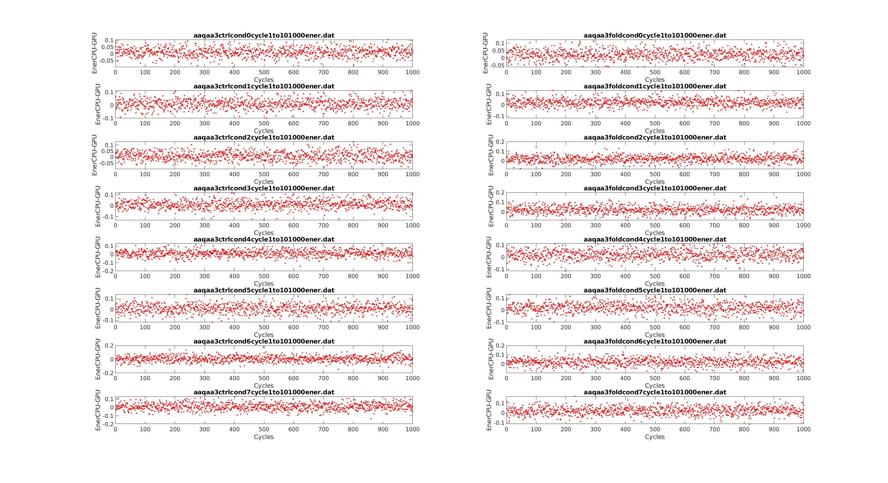
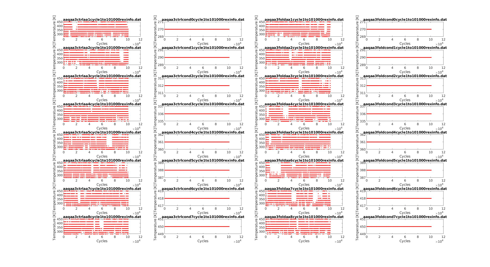
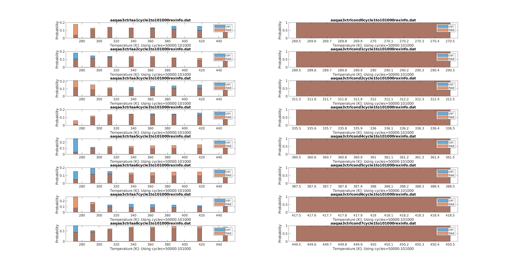
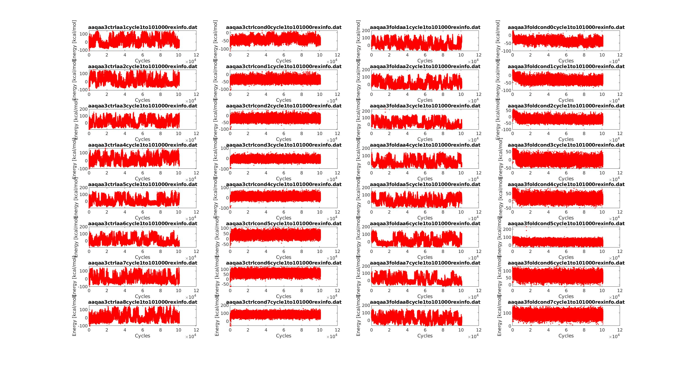
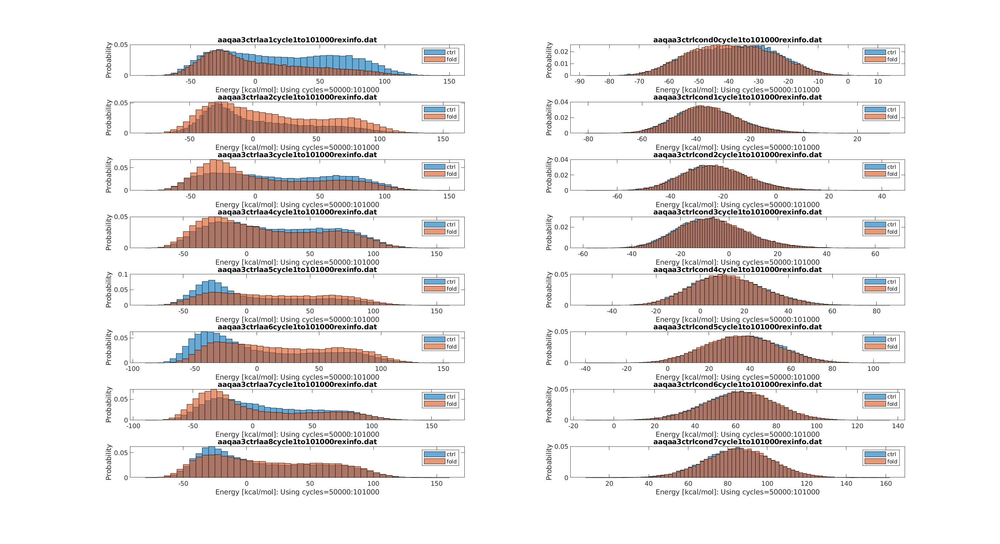
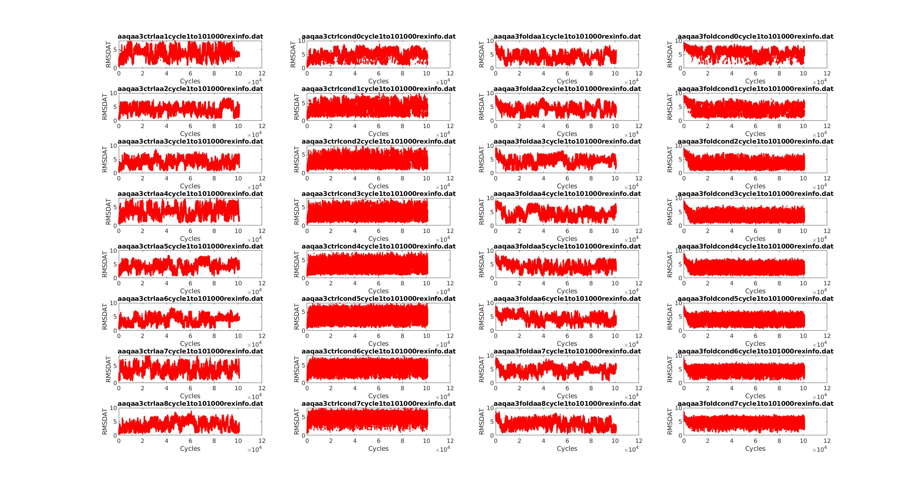
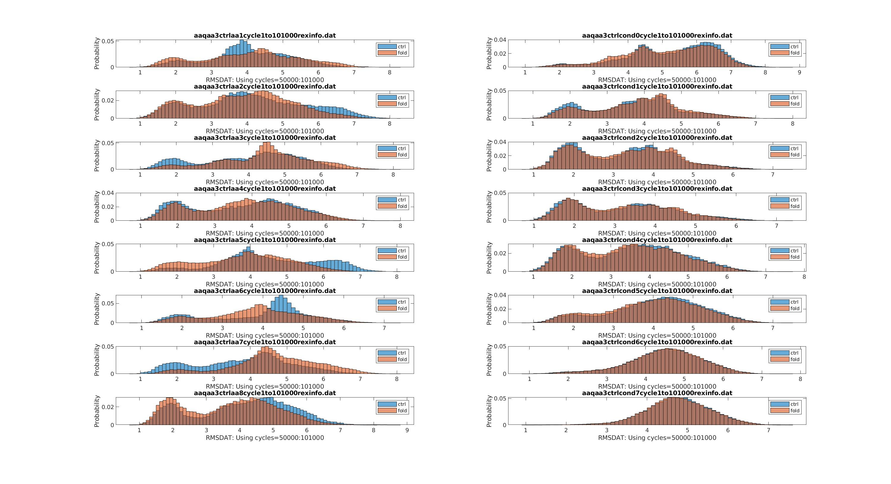
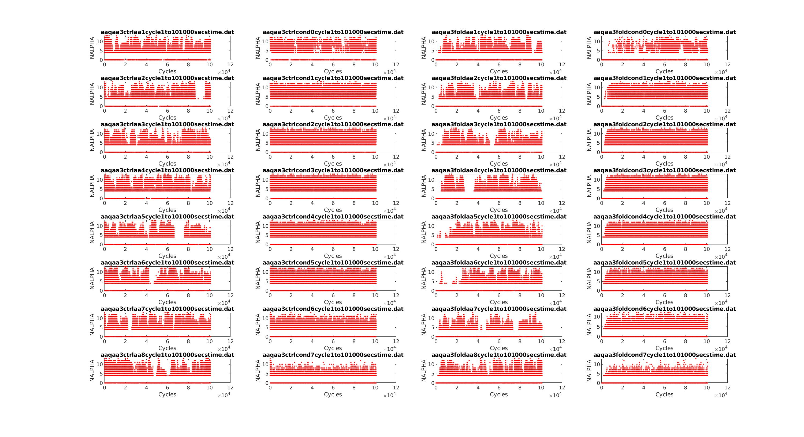
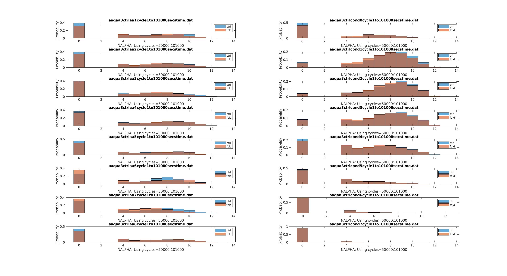

# The Implementations of GPU-GBMV2/SA-MSES

Xiping Gong

03/01 - 03/31/2020

## Summary of what you have done since your last report

1. Debug GPU-GBMV2/SA-MSES model 

> what():  Error downloading array GridDimXYZ: CUDA error (700)?

> because the forces are so larger resulted from the small distances between certain AT and CG atoms.
> One way to avoid it is to separate the AT and CG systems totally, making sure their distances are 
> always more than an enough larger value.

2. Analyze the Temperature/MSES-GBMV2/SA replica exchange simulations using [the MMTSB tools](https://github.com/mmtsb/toolset) and in-house scripts

> the central idea is to calcualte the properties versus simulation time, such as temperature, total energy, rmsd, secondary structure, etc.
> Then, the probability of each properties is also calcualted to confirm the simulations convergence.

## The motivation/goals of what you have done

The goal is to explore the capabilities of MSES-GBMV2/SA to accelerate the conformational
transitions of disordered proteins, and reproduce the [CPU results](https://onlinelibrary.wiley.com/doi/full/10.1002/jcc.24734).

## Analysis/conclusion of the results: progress and remaining problems

1. (AAQAA)3 helix-coil transitions

The (AAQAA)3 peptide is a simple peptide that were simulated by many studues, because
it can reflect the helix-coil transitions.
200ns simualtions were carried out in the GPU/MSES-GBMV2/SA and two independent simulations
were run, in order to comfirm the simulations convergence.
The simulations details can be found in /home/ping/work/mses/aaqaa3 in pikes.

2. Properties

* Energy difference between CPU and GPU

This step is to calculate the total energies from the CPU calculation (khlee) and 
GPU calculations (xiping) for all trajectories created by replica exchange simulations.
It can be seen from Figure 1 that the difference is small and stable for all first 500 trajectories
in all conditions, which shows that the energy calculations should be consistent in GPU and CPU 
MSES-GBMV2/SA calculations.

* Temperature

* Total energy

* rmsd of AT system

* Helicity of AT system

Based on the calculations of temperature, total energy, rmsd and helicity, it can be concluded that the MSES-GBMV2/SA
has a good convergence. The MSES can accelerate the GBMV2/SA calculations. However, more data should be included in the
future for more complicated flexible proten systems.

## Future plan and why

The future plan is below, 

* to test more flexible proteins and analyze these trajectories

More proteins include the GB1p, GB1m1, GB1m3 and KID.

* to see whether use the wham-like algorithm to enhance the T/MSES-GBMV2/SA convergence?

Because we used 8 replicas, it means we should have 8 x 200ns = 1.6us simulations time, but when we analyze the 
the simulations data, we just used 200ns snapshots, instead of all simulations time.
So one question is whether a wham-like algorithm can be used in the T/MSES-GBMV2/SA calculations, to improve the
convergence?

